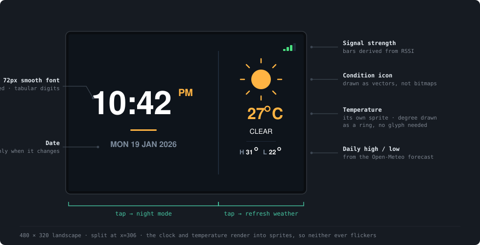

<div align="center">

# Table Clock

**A network-synced desk clock for the ESP32 and a 3.5" ILI9488 touch panel.**

Twelve-hour time and date on the left, live weather on the right,
one hairline rule between them.


</div>



Time comes from NTP, weather from [Open-Meteo](https://open-meteo.com/)
(no API key required), and the location is resolved from your public IP
with a hardcoded fallback. Once it is on the shelf it needs nothing from
you — it recovers from WiFi drops, NTP failures and API errors on its own.

---

## What makes it nice to look at

Most hobby clock firmware looks like hobby clock firmware. Three
decisions account for the difference here.

**The clock face is a real anti-aliased font.** Bitmap fonts scaled with
`setTextSize(2)` duplicate pixels, so every jagged edge becomes a 2×2
block — the classic blocky-digits look. This uses a VLW smooth font
instead: 8-bit coverage per pixel, blended against the background, drawn
at its authored 72px. The digits are tabular, so the time never twitches
sideways as the minutes tick.

**Nothing flickers.** After boot, `fillScreen()` is never called again.
The two regions that change often render into `TFT_eSprite` buffers and
push in a single blit; everything else repaints only when its own data
changes. The date waits for the day to roll over.

**It gets out of your way at night.** Between 22:00 and 06:00 the UI
switches to dim amber on true black, which preserves dark-adapted vision.
Wire one optional jumper and the backlight dims with it.

---

## Wiring

Fourteen pins on the display become **eleven wires** — three ESP32 pins
take two each, because the display and touch controller share one SPI bus.

> [!WARNING]
> `VCC` goes to **3V3, not 5V**. The ILI9488 is rated 3.6 V maximum, and
> these red modules ship in two variants. 3.3 V is safe on both.


Two pins stay deliberately unconnected. The display's `SDO` does not
release the bus when its chip select goes high, so wiring it would fight
the touch controller on GPIO 19 — and nothing here reads from the display
anyway. `T_IRQ` is unused because TFT_eSPI polls over SPI.

Full pinout, bus topology and bring-up order: **[docs/hardware.md](docs/hardware.md)**

---

## Quick start

**1 · Wire it up** — eleven wires, as above.

**2 · Add your WiFi credentials**

```bash
cp src/secrets.example.h src/secrets.h
```

Edit `src/secrets.h`. It is gitignored and will never be committed.

**3 · Build and flash**

```bash
pio run -t upload -t monitor
```

**4 · Calibrate touch** — tap the four corner arrows on first boot. The
result is stored in NVS and survives reflashing. To redo it, hold a
finger on the screen while powering on.

If anything misbehaves, flash the diagnostic instead of guessing. It
reports raw pressure and coordinates, and draws no text at all, so it
works even when fonts are misconfigured:

```bash
pio run -e touch-test -t upload -t monitor
```

---

## Controls

| Action | Result |
| :-- | :-- |
| Tap the **left** half | Toggle night mode |
| Tap the **right** half | Refresh weather now |
| Hold while powering on | Re-run touch calibration |

Input is handled on the press *edge*, so resting a finger on the screen
does not spam the weather API.

---

## How it works

Three layers, one direction of dependency: `main` drives `net` and `ui`,
`ui` reads from `net`, and `net` knows nothing about rendering.

`setup()` paints the real UI immediately rather than holding you on a
splash screen — fields fill in as data arrives. `net::update()` then owns
every timer (WiFi retry, NTP re-sync, weather refresh) and reports back
what changed, so `loop()` only has to translate flags into region
repaints.

```
src/
  main.cpp            state machine, touch, backlight, night mode
  config.h            layout geometry, palettes, timings
  net.h  / net.cpp    WiFi, NTP, Open-Meteo
  ui.h   / ui.cpp     all rendering
  font_clock72.h      anti-aliased 72px clock face (generated)
tools/
  ttf2vlw.py          TTF → smooth-font generator
  touch_test/         XPT2046 diagnostic
```

| Footprint | |
| :-- | :-- |
| Flash | 1029 KB · 78.5% |
| Static RAM | 48 KB · 14.8% |
| Sprites (heap) | ~58 KB |

Render loop, font pipeline and the full configuration reference:
**[docs/architecture.md](docs/architecture.md)**

---

## Documentation

| | |
| :-- | :-- |
| **[Hardware & wiring](docs/hardware.md)** | Pinout, bus topology, bring-up order, backlight dimming |
| **[Architecture](docs/architecture.md)** | Layering, render loop, fonts, configuration reference |
| **[Troubleshooting](docs/troubleshooting.md)** | Every failure this project actually hit, and why |

A note on that last one: it is not boilerplate. Each entry is a real
failure with its real mechanism — why undefined `TFT_MISO` silently
disables the bus, why 40 MHz on the display corrupts *touch* reads, why
missing font flags produce a working UI with no text. They cost real
debugging time, so they are written down.

---

## Built with

- **[TFT_eSPI](https://github.com/Bodmer/TFT_eSPI)** — display, touch, sprites, smooth fonts
- **[ArduinoJson](https://arduinojson.org/) v7** — weather response parsing

LVGL is deliberately avoided; the UI is small enough that direct drawing
is lighter and easier to reason about.

All hardware configuration lives in **[platformio.ini](platformio.ini)**
rather than TFT_eSPI's `User_Setup.h` — that file sits under `.pio/`,
which is gitignored, so anything put there is lost on a clean checkout.

<div align="center">
  
  <br>
  <sub>The hardware, before the rewrite</sub>
</div>

---

<div align="center">
  <sub>MIT licensed — see <a href="LICENSE">LICENSE</a></sub>
</div>
