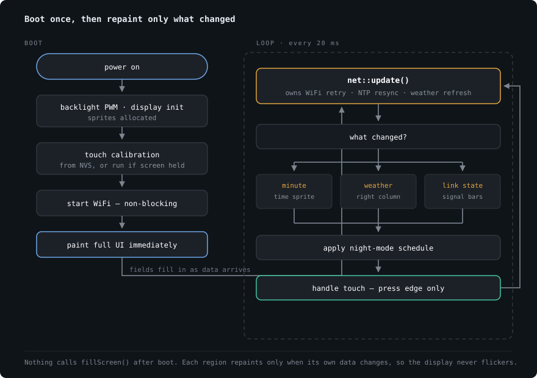

# Architecture

[← back to README](../README.md)

## Layout

```
platformio.ini            all TFT_eSPI + hardware config
src/
  main.cpp                state machine, touch, backlight, night mode
  config.h                layout geometry, palettes, timings
  net.h / net.cpp         WiFi, NTP, Open-Meteo
  ui.h / ui.cpp           all rendering
  font_clock72.h          anti-aliased 72px clock face (generated)
  secrets.h               WiFi credentials — gitignored
  secrets.example.h       template to copy
tools/
  ttf2vlw.py              TTF → smooth-font generator
  touch_test/main.cpp     XPT2046 diagnostic
```

Three layers with one direction of dependency: `main` drives `net` and
`ui`; `ui` reads from `net`; `net` knows nothing about rendering.

---

## Flow



`setup()` paints the real UI immediately rather than holding you on a
splash screen — fields fill in as data arrives. Boot never blocks waiting
for WiFi or NTP.

`net::update()` owns every timer and returns a `NetEvents` struct saying
what changed:

```cpp
struct NetEvents {
    bool minuteChanged;
    bool weatherChanged;
    bool wifiChanged;
    bool timeJustSynced;
};
```

`loop()` translates those flags into region repaints. Nothing calls
`fillScreen()` after boot.

### Timers

| What | Interval | On failure |
| --- | --- | --- |
| Weather refresh | 15 min | Retry after 60 s |
| WiFi reconnect | 30 s | Keeps retrying |
| NTP re-sync | 6 h | Retry every 60 s while unsynced |
| Signal bars | 30 s | — |

The weather backoff matters: advancing the timestamp only on *success*
means a failing API is retried every loop iteration, so a blocking HTTPS
request fires every 20 ms. The timer is advanced either way, with a
shorter interval after a failure.

---

## Rendering

The two regions that change often — the clock and the temperature —
render into `TFT_eSprite` buffers and push in a single blit, so neither
ever flickers.

`TFT_eSprite` derives from `TFT_eSPI`, which lets every render function
take a `TFT_eSPI&` and work unchanged against either target:

```cpp
void renderTime(TFT_eSPI &g, int16_t ox, int16_t oy);
```

Called with the sprite at `(0, 0)`, or with the panel at the region's
real offset if a sprite allocation ever fails. One code path, free
fallback.

### Geometry

All positions live in `config.h` as named constants, so the layout can be
retuned without touching drawing code. The screen splits at
`DIVIDER_X = 306`: clock left, weather right.

### Themes

`Theme` is a plain struct of RGB565 values, with `THEME_DAY` and
`THEME_NIGHT` as `constexpr` instances. Switching themes swaps the struct
and repaints — no per-colour conditionals anywhere in the drawing code.

Night mode uses dim amber on true black, which preserves dark-adapted
vision.

---

## Fonts

Two font systems, chosen per element.

**GFX free fonts** (`FreeSansBold12pt7b` and friends) are 1-bit — each
pixel is fully on or off. Fine at their native size, which is how every
label here uses them.

**VLW smooth fonts** carry 8-bit coverage per pixel, so TFT_eSPI blends
each edge against the background. This is what the clock uses, and it is
the only way to get clean large digits: bitmap fonts scaled with
`setTextSize(2)` duplicate pixels, turning every jagged edge into a 2×2
block.

Three things the VLW path requires:

- `-DSMOOTH_FONT=1` in `build_flags`.
- `setTextColor(fg, bg)` with **both** arguments — the blend target comes
  from `textbgcolor`, and one-argument form fringes the edges wrongly.
- No `setTextSize()`. VLW fonts render at their authored size only, which
  is exactly why they stay clean.

A loaded VLW font also overrides `setFreeFont()` entirely, so
`renderTime()` calls `unloadFont()` before drawing the AM/PM label.

### Regenerating the clock face

`src/font_clock72.h` holds 14 glyphs (`0-9 : - .` and space) of Arial
Bold at 72px — 18.9 KB. The digit advance is a uniform 40px, so the clock
never shifts sideways as the minutes tick.

```bash
python tools/ttf2vlw.py path/to/YourFont-Bold.ttf 72 FontClock72 src/font_clock72.h
```

The generator sets the header's ascent and descent from the **actual
glyph extremes** rather than the typeface's metrics. TFT_eSPI uses their
sum as the line height for datum maths, so a digits-only font with no
descenders must report descent ≈ 0 or every string sits visibly high in
its box.

> [!NOTE]
> The committed font is rasterised Arial Bold, which Monotype licenses
> and Windows bundles. If that matters for your use of this repository,
> regenerate from an OFL face — Noto Sans, Inter and Roboto all work.

---

## Configuration

Hardware config lives in `platformio.ini` `build_flags`, **not** in
TFT_eSPI's `User_Setup.h`.

> [!IMPORTANT]
> `.pio/` is gitignored, so anything written into the library's
> `User_Setup.h` is silently lost on a clean checkout or `pio run -t clean`.
> `USER_SETUP_LOADED=1` makes TFT_eSPI skip that file entirely.

Everything else is in `src/config.h`:

| Setting | Default | |
| --- | --- | --- |
| `GMT_OFFSET_SEC` | `19800` | UTC+5:30 (IST) |
| `DEFAULT_LAT` / `DEFAULT_LON` | Bangalore | Fallback if IP lookup fails |
| `NIGHT_START_HOUR` / `NIGHT_END_HOUR` | `22` / `6` | Auto night window |
| `WEATHER_REFRESH_MS` | 15 min | Matches Open-Meteo's update rate |
| `WEATHER_RETRY_MS` | 60 s | Backoff after a failed fetch |
| `NTP_RESYNC_MS` | 6 h | Drift correction |
| `TOUCH_Z_THRESHOLD` | `400` | Raw pressure counting as a press |
| `BACKLIGHT_ENABLED` | `1` | See [hardware](hardware.md) |

Set `LOCATION_FROM_IP` to `0` in `src/net.h` to skip the IP lookup.

---

## Touch

Calibration is stored in NVS via `Preferences`, so it survives reflashing.
Holding the screen during power-on forces a fresh run.

That check reads `getTouchRawZ()` rather than `getTouch()` deliberately:
no calibration has been applied at that point, so `getTouch()` would map
a real press through TFT_eSPI's placeholder values, land off-screen, and
report nothing.

Input is handled on the **press edge**. A cheap pressure gate runs first,
because `getTouch()` performs up to five validated sample rounds with
internal delays — wasted SPI traffic on the vast majority of loops where
nothing is touching. Without edge detection, a resting finger on the
right half would re-fire every 400 ms and hammer the weather API with
blocking requests.

| Zone | Action |
| --- | --- |
| Left of `DIVIDER_X` | Toggle night mode |
| Right of `DIVIDER_X` | Refresh weather |

---

## Memory

| | |
| --- | --- |
| Static RAM | ~48 KB (14.8%) |
| Sprites (heap) | ~58 KB — 290×78 and 158×44, both 16-bit |
| Flash | ~1029 KB (78.5%) |

Bitmap fonts `LOAD_FONT2/4/6/7/8` are deliberately not compiled in;
nothing calls `setTextFont()`. `LOAD_GLCD` stays as a cheap safety net.
