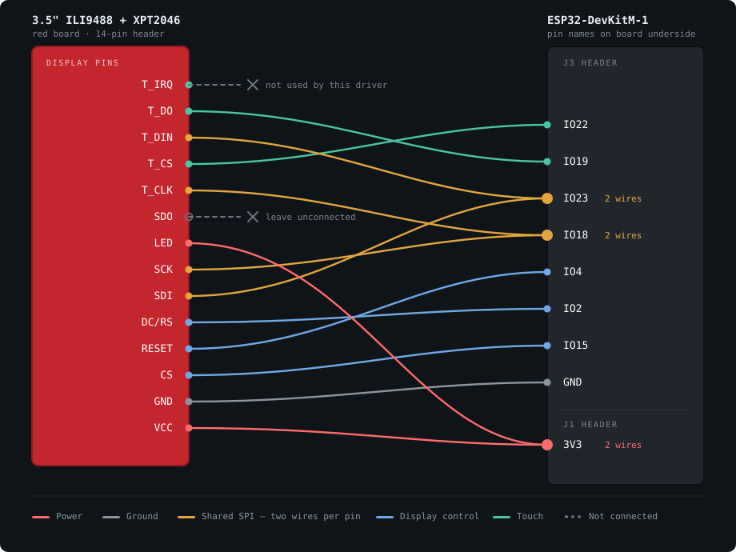
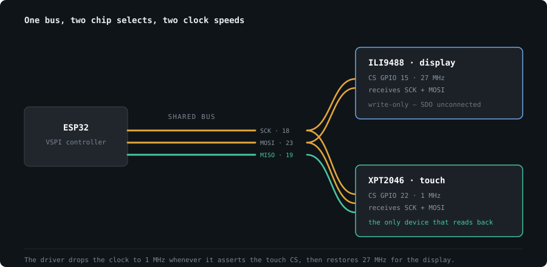

# Hardware & Wiring

[← back to README](../README.md)

| Part | Notes |
| --- | --- |
| ESP32-DevKitM-1 | ESP32-MINI-1 module, 4 MB flash |
| 3.5" ILI9488 SPI TFT | 480 × 320, the common red board |
| XPT2046 | Resistive touch, shares the SPI bus |

Any ESP32 dev board works — the DevKitM-1 is simply what this was built
on. Every signal pin used here is broken out on its **J3** header; only
3V3 comes from J1 on the opposite edge.

---

## Before you connect power

> [!WARNING]
> **VCC goes to 3V3, not 5V.** The ILI9488 is rated 3.6 V maximum. These
> red modules ship in two variants, selected by the `J1` solder pad next
> to `RESET`, and 3.3 V is safe on both. Only if the screen stays dark
> with everything else correct should you try the 5V pin.

---

## Connections

Fourteen pins on the display become **eleven wires**, because three ESP32
pins take two wires each.



| Display pin | ESP32 | Why |
| --- | --- | --- |
| `VCC` + `LED` | **3V3** | Panel supply and backlight |
| `GND` | **GND** | J3, bottom pin |
| `CS` | **GPIO 15** | Display chip select |
| `RESET` | **GPIO 4** | Must be driven — a floating reset never initialises |
| `DC/RS` | **GPIO 2** | Data/command select |
| `SDI` + `T_DIN` | **GPIO 23** | Shared MOSI |
| `SCK` + `T_CLK` | **GPIO 18** | Shared clock |
| `T_DO` | **GPIO 19** | MISO — touch only |
| `T_CS` | **GPIO 22** | Touch chip select |
| `SDO` | *nothing* | See below |
| `T_IRQ` | *nothing* | Unused by this driver |

### Why `SDO` stays unconnected

On many of these red modules the ILI9488 does not release `SDO` when its
chip select goes high. Wire it alongside `T_DO` and the two fight over
GPIO 19, and touch reads come back as garbage. Nothing in this firmware
reads from the display, so the wire has no purpose — leave it off.

### Why `T_IRQ` is unused

TFT_eSPI's built-in touch driver polls the controller over SPI rather
than waiting on the interrupt line. Wire GPIO 21 or don't; it changes
nothing.

---

## The bus



Two consequences are worth understanding, because both produce failures
that look exactly like bad wiring:

**`TFT_MISO` must be defined.** Left undefined, TFT_eSPI falls back to
`#define TFT_MISO -1` and hands that straight to the SPI peripheral as
`.miso_io_num = -1`. The bus is then configured read-disabled and touch
returns nothing, no matter how correctly the panel is wired.

**The display's clock speed affects touch.** `SCK` and `MOSI` are shared,
so ringing at 40 MHz corrupts the touch ADC samples. `validTouch()`
requires two successive readings to agree within 20 counts out of 4096,
and noisy samples fail that test — which surfaces as touch that works
only intermittently. 27 MHz is stable over jumper wires.

---

## Bring-up order

1. **Power only** — `VCC`, `LED`, `GND`. The backlight should glow white.
2. **Display signals** — `CS`, `RESET`, `DC`, `SDI`, `SCK`. Flash and
   confirm the UI appears.
3. **Touch** — the remaining four wires.

If anything misbehaves, flash the diagnostic rather than guessing:

```bash
pio run -e touch-test -t upload -t monitor
```

It reports raw pressure and coordinates, draws a dot under your finger,
and uses no text at all — so it works even when fonts are misconfigured.
See [troubleshooting](troubleshooting.md) for what its output means.

---

## Optional: backlight dimming

Night mode re-themes the UI on its own. For the backlight to physically
dim, move the display's `LED` wire from `3V3` to **GPIO 32** — same J1
header, five pins down.

Some of these boards drive the backlight through a transistor and some do
not. If the panel looks dim when driven from a GPIO, put `LED` back on
3V3 and set `BACKLIGHT_ENABLED` to `0` in `src/config.h`; night mode
still works, just without dimming.
